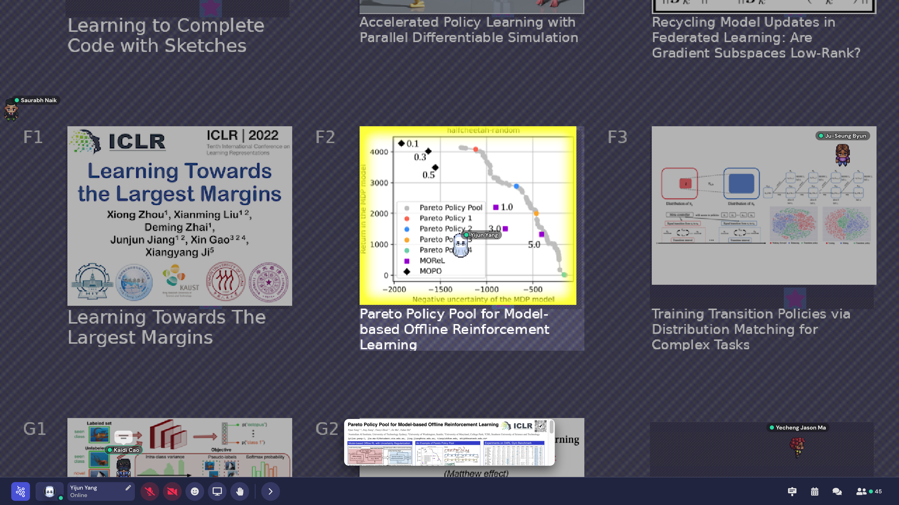

[More information here](https://iclr.cc/virtual/2022/poster/6152)

[link to the poster](../assets/p3_iclr2022_poster.pdf)

Online reinforcement learning (RL) can suffer from poor exploration, sparse reward, insufficient data, and overhead caused by inefficient interactions between an immature policy and a complicated environment. Model-based offline RL instead trains an environment model using a dataset of pre-collected experiences so online RL methods can learn in an offline manner by solely interacting with the model. However, the uncertainty and accuracy of the environment model can drastically vary across different state-action pairs so the RL agent may achieve high model return but perform poorly in the true environment. Unlike previous works that need to carefully tune the trade-off between the model return and uncertainty in a single objective, we study a bi-objective formulation for model-based offline RL that aims at producing a pool of diverse policies on the Pareto front performing different levels of trade-offs, which provides the flexibility to select the best policy for each realistic environment from the pool. Our method, ''Pareto policy pool (P3)'', does not need to tune the trade-off weight but can produce policies allocated at different regions of the Pareto front. For this purpose, we develop an efficient algorithm that solves multiple bi-objective optimization problems with distinct constraints defined by reference vectors targeting diverse regions of the Pareto front. We theoretically prove that our algorithm can converge to the targeted regions. In order to obtain more Pareto optimal policies without linearly increasing the cost, we leverage the achieved policies as initialization to find more Pareto optimal policies in their neighborhoods. On the D4RL benchmark for offline RL, P3 substantially outperforms several recent baseline methods over multiple tasks, especially when the quality of pre-collected experiences is low.

